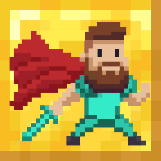

# Battle Blox
## Minecraft Bedrock Edition

Battle Blox is a multi-player mini-game I created for Minecraft Bedrock Edition that has a similar concept of [Lucky Block](https://www.luckyblockmod.com/).

---

### Game Play and Rules

- Push the **PLAY** button when all players are ready.

- Players have **10 seconds** to pick a team:
    - RED
    - YELLOW
    - GREEN
    - BLUE

- Any player that does not pick a team within **10 seconds** will be killed.

- Once the game begins, collect as much as you can:
    - WEAPONS
    - ARMOR
    - FOOD
    - MONEY

- Players can walk on pressure plates to be randomly **teleported**.

- Players have **5 minutes** to collect as much loot as possible.

- Players can trade **ingots** for better **loot**.

- Any player that **dies**, will play as **specator** mode and watch the rest of the battle from above.

- Last player **WINS**.

- Players are taken to the **Winner's Area**, and the game will reset automatically.

---

### Installation Guide

To be improved in the future.

- Currently you will need to create this folder inside of your **com.mojang** directory, within the **minecraftWorlds** folder.

- In the future, I shall make a single file to auto-launch the game.

---

### Credits

Battle Blox design borrowed and edited from [Photoshop Essentials](https://www.photoshopessentials.com/newsite/wp-content/uploads/2018/09/howto-resize-pixel-art-photoshop-f.png).
